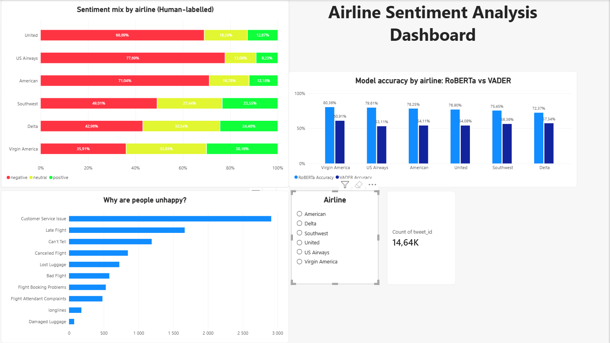
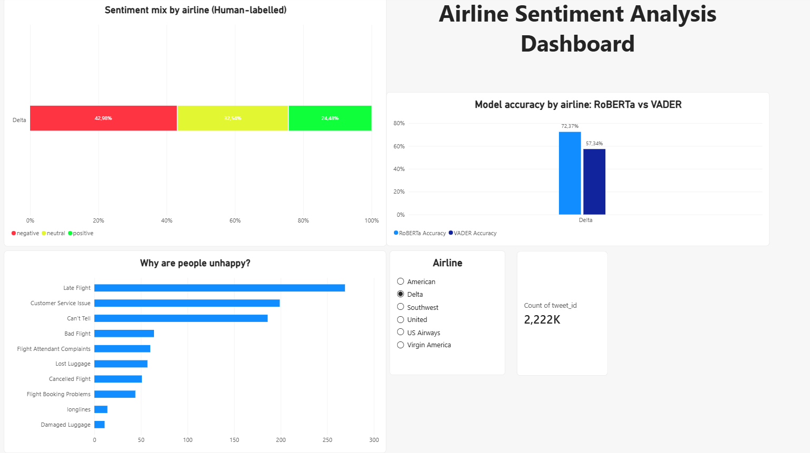
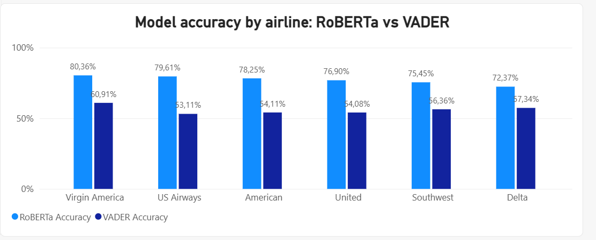

# Sentiment Analysis and Data Insights

This project explores airline-related tweet sentiment using a comparison between a rule-based baseline (VADER) and a transformer-based language model (RoBERTa). The analysis is based on the Kaggle "Twitter US Airline Sentiment" dataset and prepares a cleaned dataset for dashboard reporting.

## Project goal

The main objective was to classify each tweet into one of the airline sentiment labels:

- negative
- neutral
- positive

and then evaluate how well the rule-based VADER method and the RoBERTa model align with the human-annotated labels supplied with the dataset.

## Data source

The project uses the Kaggle "Twitter US Airline Sentiment" dataset. It contains 14,640 tweets collected between 17 and 24 February 2015 from six US airlines: United, US Airways, American, Southwest, Delta, and Virgin America. The labels were human-annotated and supplied with the dataset, not provided by the airlines.

The label distribution in the dataset is:

- negative: 9,178 (62.7%)
- neutral: 3,099 (21.2%)
- positive: 2,363 (16.1%)

## Results

| Model | Accuracy | Macro F1 | Notes |
| --- | ---: | ---: | --- |
| VADER (raw text) | 0.490 | — | Baseline result on raw text |
| VADER (cleaned text) | 0.550 | 0.514 | Cleaned text result |
| RoBERTa | 0.769 | 0.734 | Transformer-based classifier |

The confidence subset with label confidence >= 0.7 contains 10,768 tweets. In this subset, VADER achieved 0.592 accuracy and 0.532 macro F1, while RoBERTa achieved 0.840 accuracy and 0.790 macro F1. This subset is a robustness check, not the headline result, because it has proportionally more negative tweets (70.1%) and fewer neutral tweets (15.2%).

## Coursework & Applied Competencies

This project maps to the core concepts in the Coursera modules below without claiming course completion.

### Python for Data Science, AI & Development

- Data loading and cleaning with pandas
- Exploratory data analysis on airline tweet data
- Label analysis, distribution checks, and dataset validation
- Basic model evaluation using accuracy, classification reports, and confusion matrices
- Data preparation for reporting and visualization

### Generative AI with LLMs

- Transformer-based text classification using a Hugging Face model
- Language understanding for customer feedback and social media text
- Context-aware sentiment inference for airline complaints
- Use of a transformer-based language model for text classification

### Applied competencies demonstrated in this repository

- Sentiment analysis
- Text classification
- Data visualization
- Basic ML evaluation and model comparison

## How the Solution Works

### 1. Analysis notebook: [notebooks/01_explore.ipynb](notebooks/01_explore.ipynb)

The notebook is the primary analytical workflow in this project. It performs the following steps:

- loads the source tweet dataset
- filters the columns required for analysis and reporting
- inspects the label distribution and dataset structure
- cleans tweet text for VADER preprocessing
- applies VADER to both raw and cleaned text
- compares VADER output to the human-annotated labels supplied with the dataset
- computes accuracy, confusion matrices, and classification reports
- checks duplicate tweet IDs and exact-copy rows as a sensitivity check
- joins RoBERTa predictions back to the main dataset
- exports a dashboard-ready dataset for downstream reporting

This notebook is the main place where the business questions are translated into data science analysis.

### 2. RoBERTa prediction script: [score_roberta.py](score_roberta.py)

The scoring script handles the transformer-based sentiment stage. It does the following:

- normalizes tweet text for model input
- removes URLs and standardizes usernames and HTML leftovers
- loads the Hugging Face model: cardiffnlp/twitter-roberta-base-sentiment-latest
- runs sentiment analysis in batches for efficiency
- stores the predictions in [outputs/roberta_results.csv](outputs/roberta_results.csv)

This script turns tweet text into a structured sentiment output that can be merged back into the main dataset.

### 3. Output data and reporting pipeline

The workflow exports the following files:

- [outputs/roberta_results.csv](outputs/roberta_results.csv) - RoBERTa sentiment predictions
- [outputs/dashboard_data.csv](outputs/dashboard_data.csv) - cleaned dataset prepared for reporting

These outputs support dashboard interpretation and operational analysis.

### 4. Duplicate handling and sensitivity check

The project reviewed duplicate tweet IDs and exact-copy rows. It found 155 tweet IDs that appear twice, 62 rows that are exact copies, and 18 IDs with conflicting labels. All 14,640 rows were kept in the main analysis, and the repeated IDs were treated as a sensitivity check because removing them left all metrics unchanged.

## Dashboard Overview

The project includes a dashboard file at [dashboard/airline_sentiment_dashboard.pbix](dashboard/airline_sentiment_dashboard.pbix). The dashboard contains the following elements only:

- sentiment mix by airline using the human-annotated labels
- complaint reasons chart
- model accuracy by airline comparing RoBERTa vs VADER
- an airline slicer

The dashboard has no time or trend view.

### Dashboard screenshots

Dashboard overview: sentiment mix by airline (human-labelled), complaint reasons, model accuracy by airline, and an airline slicer.

Dashboard with Delta selected, where every chart filters to that airline. Delta's top complaint is late flights, while for the other five airlines it is customer service.

Accuracy of RoBERTa and VADER against the human labels, by airline.

These images must be added to the repository before publishing the dashboard in a portfolio context.

## How to run

1. Create a virtual environment in the project folder.
2. Install the dependencies with: `pip install -r requirements.txt`
3. Run the RoBERTa prediction script: `python score_roberta.py`
4. Allow about 9 minutes on CPU for the model to download and run, as the model downloads about 500 MB.
5. Open and run the cells in [notebooks/01_explore.ipynb](notebooks/01_explore.ipynb) in order to reproduce the analysis and metrics.

## Project files

- [notebooks/01_explore.ipynb](notebooks/01_explore.ipynb) - main exploratory analysis and evaluation notebook
- [score_roberta.py](score_roberta.py) - RoBERTa inference pipeline
- [data/Tweets.csv](data/Tweets.csv) - source tweet dataset
- [outputs/roberta_results.csv](outputs/roberta_results.csv) - model output predictions
- [outputs/dashboard_data.csv](outputs/dashboard_data.csv) - dashboard-ready export
- [dashboard/airline_sentiment_dashboard.pbix](dashboard/airline_sentiment_dashboard.pbix) - dashboard artifact
- [INSIGHTS_REPORT.md](INSIGHTS_REPORT.md) - summary of findings and business insights

## Key takeaway

This project demonstrates a practical sentiment-analysis workflow for social media data: preprocessing text, comparing a general lexicon model with a transformer model, validating against human-annotated labels, and exporting a clean dataset ready for insight generation.

The notebook acts as the primary record of the analysis, while the Python script automates the RoBERTa prediction stage and the outputs folder stores the reusable result files.
